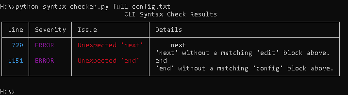

# FortiGate-SyntaxChecker

Python script to check the CLI syntax of a FortiGate backup file.

## Installation

1. Clone this repository or download the files to your local machine.
2. Make sure you have Python 3.7 or newer installed.
3. Install the required package using pip:

    ```sh
    pip install -r requirements.txt
    ```

## Usage

Run the syntax checker on a FortiGate CLI script file:

```sh
python syntax-checker.py path/to/cli_script.txt
```

To include warnings in the output, use:

```sh
python syntax-checker.py path/to/cli_script.txt --warnings
```

## Output

The script will print a table of potential issues found in the CLI script, including line numbers, severity, and details.



## Implemented Checks

The script performs the following heuristic checks on your FortiGate CLI script:

- **Top-level command validation:** Flags unknown or uncommon commands not in the standard FortiGate CLI set.
- **Block structure:** Checks for correct usage and closure of `config`, `edit`, `next`, and `end` blocks. Reports unclosed or misplaced blocks.
- **Argument presence:** Ensures required arguments are present for commands like `config`, `edit`, and `set`.
- **Multiline quoted values:** Handles and validates multiline quoted values (e.g., certificates, keys), including context checks for certificate/key blocks.
- **Certificate block validation:** Checks for presence of public/private keys in certificate blocks.
- **IP address validation:** Verifies that values expected to be IPv4 addresses are valid.
- **Network validation:** Checks for valid IPv4 network notation (CIDR).
- **Assignment operator:** Warns if `=` is used instead of space for assignments (FortiGate CLI expects space-separated tokens).
- **Boolean value checks:** Warns if a `set` command is missing a value, unless the option is a known boolean.
- **Escape sequence validation:** Flags invalid use of escape sequences (e.g., `\"` outside allowed contexts).
- **Comment handling:** Ignores full-line comments and strips inline comments for parsing.
- **Incomplete commands:** Warns about possibly incomplete commands like `get`, `show`, `diagnose`, or `execute` with no arguments.
- **Extra tokens:** Reports extra tokens after `next` or `end` commands.
- **General parse errors:** Reports unmatched quotes and other parsing issues.

## Notes

- This tool uses heuristic checks and is not an authoritative parser for FortiGate CLI.
- It is intended to help catch common mistakes and formatting issues before uploading or restoring configurations.
